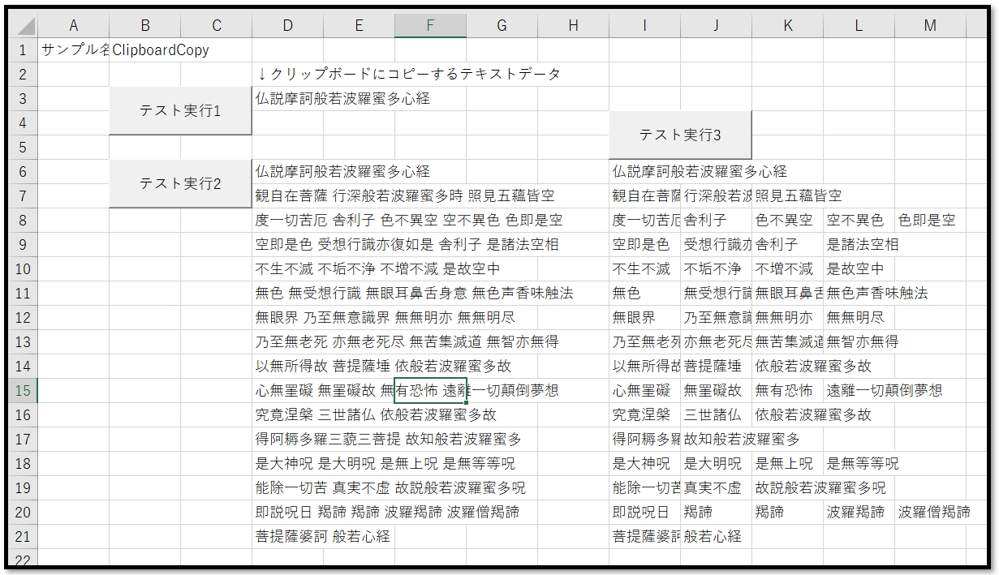
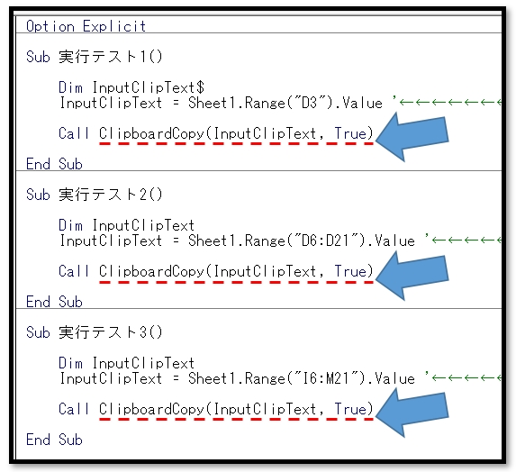

# VBA-ClipboardCopy
- License: The MIT license

- Copyright (c) 2021 YujiFukami

- 開発テスト環境 Excel: Microsoft® Excel® 2019 32bit 

- 開発テスト環境 OS: Windows 10 Pro

実行環境など報告していただくと感謝感激雨霰。

# 説明
入力テキストをクリップボードに格納
入力テキストが配列ならば列方向をTabわけ、行方向を改行する。

## 活用例
クリップボードにテキストデータ格納を自動化する

# 使い方
実行サンプル「Sample-ClipboardCopy.xlsm」の中の使い方は以下の通り。

サンプル中身

サンプルの実行ボタンが3つある。

「テスト実行1」は文字列単体のクリップボード格納

「テスト実行2」は一次元配列のテキストデータのクリップボード格納

「テスト実行3」は二次元配列のテキストデータのクリップボード格納

実行後にメモ帳などに貼り付けてみて動作を確認すること。

プロシージャ中身

プロシージャ「ClipboardCopy」が使われている。

引数は

-  InputClipText・・・クリップボードに格納するテキストデータ。文字列(String型)もしくは文字列の入った配列(一次元、二次元どちらか)

-  [MessageIrunaraTrue]・・・クリップボード格納の確認メッセージの有無。デフォルトはFalse

## 設定
実行サンプル「Sample-ClipboardCopy.xlsm」の中の設定は以下の通り。

### 設定1（使用モジュール）

-  ModTest.bas
-  ModClipboardCopy.bas

### 設定2（参照ライブラリ）
なし

